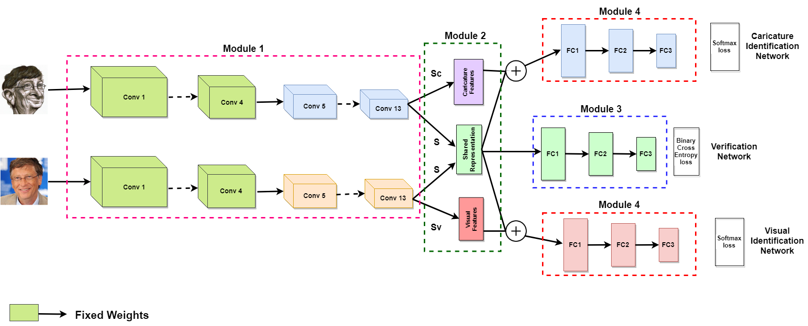

# CaVINet
Code for Deep Cross modal learning for Caricature Verification and Identification (CaVINet), ACM MM, 2018

# Dataset
Link to be added soon. Please stay tuned.

# Requirements
- Keras with TensorFlow backend
- [Keras-VggFace](https://github.com/rcmalli/keras-vggface) - `pip install keras_vggface`
- `python 2.7`

# Architecture

# Pre-trained weights
Link to be added soon. Please stay tuned.
